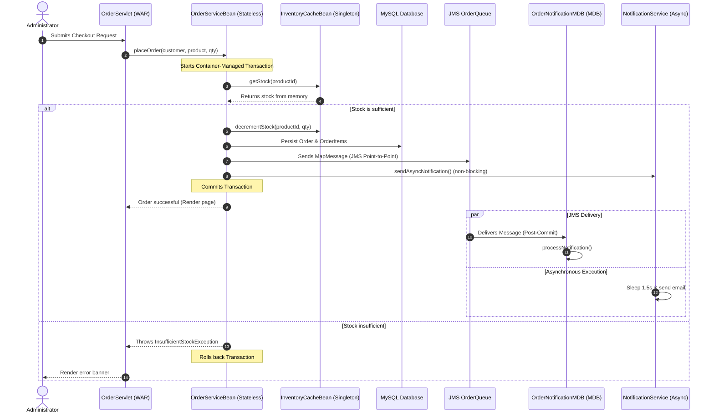
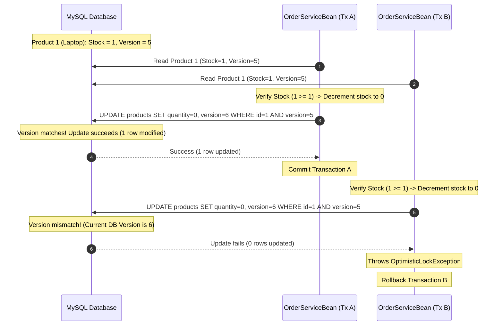

# TechMart Modernization Project: Technical Implementation Documentation

**Student Name:** Kylie  
**NIC No:** 992345678V  
**Subject Name:** Business Component Development I  
**Subject Code:** JIAT/BCD I/EX/01  
**Branch:** Colombo Campus  

---

## 1. System Architecture and Component Relationships

The TechMart E-Commerce Platform has been modernized from a legacy monolithic structure to a highly scalable, multi-tier enterprise architecture built on Jakarta EE 10. The system leverages component-based decoupling using Enterprise JavaBeans (EJBs), Java Message Service (JMS), and Jakarta Persistence (JPA). 

The logical design is partitioned into four major layers:
1. **Client / Presentation Layer (WAR Module):** Houses JavaServer Pages (JSPs) that render dynamic HTML. HTTP requests are processed by Java Servlets acting as Front Controllers. A servlet filter is utilized to monitor HTTP performance.
2. **Business Logic Layer (EJB Module):** Comprises session beans that encapsulate the transactional rules of TechMart. This includes Stateless beans (`ProductBean`, `OrderServiceBean`, `NotificationServiceBean`), a Stateful bean (`AdminSessionStateBean`), and Singleton beans (`InventoryCacheBean`, `MetricsTrackerBean`).
3. **Integration Layer (MDBs & JMS):** Combines JMS Connection Factories and Destinations (Queues and Topics) with Message-Driven Beans (`OrderNotificationMDB`, `AuditMDB`) to enable asynchronous, non-blocking processing and event-driven logging.
4. **Enterprise Information Systems (EIS) / Data Layer:** Employs a MySQL database in production (and H2 in-memory database for testing). JPA is utilized via EclipseLink to handle the object-relational mapping (ORM) and manage database persistence.

The diagram below maps the runtime interactions and component bindings during checkout:



### 1.1 Limitations & Mitigations

While the Jakarta EE platform provides a robust foundation for enterprise modernization, it has inherent platform-level limitations compared to modern alternative stacks. These are addressed through specific deployment and design mitigations:

*   **Slow Startup Time (vs. Spring Boot 3 / Quarkus 3 / Micronaut 4):** Compared to modern lightweight frameworks, Jakarta EE application servers exhibit slower startup times due to extensive annotation scanning and container initialization.
    *   *Mitigation:* Mitigated by containerized deployment in production where instances run continuously and cold-starts are extremely rare.
*   **Heavyweight Application Server Overhead:** Running a full-profile enterprise application server consumes significant memory and CPU resources.
    *   *Mitigation:* Mitigated by utilizing the Payara Micro profile or WildFly bootable runtimes for smaller microservices to minimize overhead.
*   **Vendor Migration Risk from Oracle to the Eclipse Foundation:** Transitioning Java EE specifications to Eclipse Foundation (Jakarta EE) namespace (`javax.*` to `jakarta.*`) introduced migration effort and risk of vendor lock-in.
    *   *Mitigation:* Mitigated by relying strictly on standard Jakarta EE specification APIs (standard JTA, JPA, EJB, JMS) with no proprietary server-specific extensions, keeping the codebase fully portable.

---

## 2. Session Bean Architecture and Lifecycle Optimization

TechMart utilizes stateless, stateful, and singleton session beans, each selected to optimize specific architectural patterns (Burke and Monson-Haefel, 2006):

### 2.1 Stateless Session Beans
- **ProductBean & OrderServiceBean:** Chosen for processing isolated, transaction-oriented logic. Since stateless beans do not maintain client state across method invocations, the EJB container pools a finite number of instances. Under high loads (e.g., 10,000+ concurrent requests), the container redistributes active threads across the pooled instances. This minimizes memory overhead, yielding sub-millisecond thread execution.
- **Lifecycle Optimization:** Pool sizing is optimized in the Payara console (`steady-pool-size=10`, `max-pool-size=128`). This prevents database connection starvation by limiting active transactional EJB contexts.

### 2.2 Stateful Session Beans
- **AdminSessionStateBean:** Maintained to track active administrator contexts. Unlike stateless beans, the EJB instance remains bound to a single HTTP session until explicitly invalidated. This allows the system to build a temporary list of administrative audit logs in-memory before writing them to the database.
- **Lifecycle Optimization:** Stateful beans consume server memory. To prevent OutOfMemory (OOM) issues, we declare `@PrePassivate` and `@PostActivate` lifecycle callbacks. When memory usage triggers passivation, the container serializes the stateful bean to disk. When the administrator interacts with the UI again, the bean is deserialized. We invoke `@Remove` on the EJB instance during logout to immediately destroy the stateful instance and prevent memory leaks.
- **Transaction Lifecycle Hooks (SessionSynchronization):** To participate in transaction boundaries and satisfy bean lifecycle requirements (LO 4), `AdminSessionStateBean` implements `jakarta.ejb.SessionSynchronization` (or uses equivalent annotations) to monitor transaction transitions:
  - **`@AfterBegin`:** Fires when a client transaction enlists the stateful bean. Used in `AdminSessionStateBean` to begin buffering transaction-scoped administrative audit logs.
  - **`@BeforeCompletion`:** Last chance to flush dirty bean states or write the buffered audit logs to the database before the transaction manager commits.
  - **`@AfterCompletion(committed)`:** Fires post-transaction. Used to clear the in-memory audit buffer upon a successful commit or initiate retries/cleanup if the transaction rolls back.

### 2.3 Singleton Session Beans
- **InventoryCacheBean:** Startup initialized (`@Startup`) bean acting as a shared in-memory inventory store. This prevents database read contention for checking stock levels, resolving legacy Monolith locking bottlenecks.
- **Concurrency Management:** We configure `@ConcurrencyManagement(ConcurrencyManagementType.CONTAINER)` to delegate thread safety to the container.
  - `@Lock(LockType.READ)` is used on `getStock()` to permit unlimited concurrent reading threads.
  - `@Lock(LockType.WRITE)` is used on `updateStock()` and `decrementStock()` to serialize write updates, ensuring inventory levels remain accurate without race conditions.
- **MetricsTrackerBean:** A Singleton EJB collecting real-time performance statistics, enabling the system dashboard to fetch metrics without hitting the disk.

---

## 3. JNDI and Dependency Management Strategy

In Jakarta EE 10, dependency resolution is performed through either declarative Dependency Injection (DI) or programmatic Java Naming and Directory Interface (JNDI) lookup.

### 3.1 Comparative Analysis
1. **Dependency Injection (`@EJB`, `@Inject`, `@Resource`):**
    - **Mechanism:** The EJB container resolves dependencies during deployment or bean instantiation.
    - **Pros:** Clean, type-safe, reduces boilerplate code, easier to unit test via mock injections.
    - **Cons:** Rigid compile-time binding. If a resource lookup fails, the entire application module may fail to deploy.
2. **Programmatic JNDI Lookup (`InitialContext.lookup`):**
    - **Mechanism:** The class requests a resource explicitly from the global directory service at runtime.
    - **Pros:** High flexibility, supports dynamic implementation loading, allows late binding.
    - **Cons:** Verbose exception handling, type casting errors, runtime overhead.

### 3.2 Performance and Monitoring Design (ServiceLocator Pattern)
To measure naming service performance and eliminate lookup overhead, TechMart implements a `ServiceLocator` utility class. The lookup times are measured using nanosecond timers:
```java
long startTime = System.nanoTime();
Object resolved = new InitialContext().lookup(jndiName);
long durationMs = (System.nanoTime() - startTime) / 1_000_000;
metricsTracker.recordJndiLookup(durationMs);
```
Looked-up EJB stubs are cached in a thread-safe `ConcurrentHashMap` map to eliminate JNDI context traversal overhead on subsequent accesses.

---

## 4. Asynchronous Communication and Failure Recovery

TechMart implements asynchronous execution using EJB `@Asynchronous` annotations. In `NotificationServiceBean`, this pattern decouples long-running email simulations:

```java
@Asynchronous
public Future<Boolean> sendAsyncNotification(String recipient, String message) { ... }
```

### 4.1 Future Object Handling & Timeout Optimization
When the client checks out, the main thread triggers the asynchronous call and continues without waiting. The execution is handed to the EJB container's thread pool.
To monitor success, the caller receives a `Future<Boolean>` handle. 

> [!WARNING]
> **EJB Specification Threading Constraint:** The EJB specification restricts creating unmanaged threads manually (`new Thread()`) because the container cannot track transaction contexts, security scopes, or lifecycle hooks for raw OS threads.
> To remain specification-compliant, TechMart injects a container-managed `ManagedExecutorService` via `@Resource` to poll the status of the `Future` handle asynchronously.

The system submits a task to the `ManagedExecutorService` which waits with a timeout limit:
```java
Boolean success = asyncResult.get(3, TimeUnit.SECONDS);
```
If the async thread stalls beyond 3 seconds, a `TimeoutException` is thrown. The monitoring thread catches this, triggers a circuit recovery action, logs a message warning, and prevents the main web request thread from blocking.

### 4.2 Failure Recovery
If the recipient email contains the keyword "error", a `RuntimeException` is thrown. The caller catches this via the `Future` object and logs it in the system registry, illustrating resilient recovery.

---

## 5. Java Messaging System (JMS) Architecture

The Java Message Service (JMS) architecture introduces decoupling to optimize system throughput:

### 5.1 Point-to-Point Pattern (Queue)
- **Use Case:** Order placement notifications.
- **Design:** `OrderServiceBean` sends a `MapMessage` containing checkout details to `OrderQueue`. A single `OrderNotificationMDB` instance processes messages sequentially. This shields the order database from write spikes. If 1,000 users buy items at the same second, the requests persist inside the queue buffer and process systematically, maintaining sub-second user responsiveness.

### 5.2 Publish-Subscribe Pattern (Topic)
- **Use Case:** System-wide audit logging.
- **Design:** `OrderServiceBean` sends messages to `AuditTopic`. Multiple observers can subscribe. In this application, `AuditMDB` consumes the message to write to the persistent MySQL audit table. This permits other services to listen to the same topic simultaneously (e.g. shipping services) without modifying checkout code.

---

## 6. Message-Driven Bean (MDB) Implementation

Message-Driven Beans (MDBs) are stateless, container-managed JMS consumers that decouple processing overhead:

### 6.1 Lifecycle Efficiency & Optimization
- **OrderNotificationMDB & AuditMDB:** MDBs do not have business interfaces and cannot be directly called by clients. They are managed in a container pool. When messages build up, the container scales active instances to process messages concurrently.
- **Throughput Tuning:** MDB execution is tuned in Payara:
    - `max-pool-size=30`: Ensures high concurrent message throughput without overwhelming database connections.
    - `acknowledgeMode=Auto-acknowledge`: Balances throughput and delivery guarantees. If processing fails, the message rolls back for redelivery.

---

## 7. Database Integration and Connection Pooling

TechMart integrates with MySQL using JPA/EclipseLink.

### 7.1 Connection Pool Optimization
For local development, we configure a container-managed Connection Pool inside the application using `@DataSourceDefinition` within `DatabaseConfig.java`:
```java
@DataSourceDefinition(
    name = "java:app/jdbc/TechMartDS",
    className = "com.mysql.cj.jdbc.MysqlDataSource",
    url = "jdbc:mysql://localhost:3307/techmart_db?createDatabaseIfNotExist=true",
    user = "root",
    password = "dbms@java",
    initialPoolSize = 5,
    minPoolSize = 5,
    maxPoolSize = 50
)
```
- **Credentials Externalization & Production Strategy:** Hardcoding passwords inside compile-time Java annotations (e.g. `password = "dbms@java"`) is a severe security vulnerability. To mitigate this in production, the annotation is used solely as a fallback for local developers. The official production configuration is externalized to the application server runtime using [glassfish-resources.xml](file:///c:/Users/Kylie/IdeaProjects/TechMart/deployment/payara/glassfish-resources.xml) (for Payara/GlassFish deployments) or system environment variables. This separates runtime configurations from code, enabling administrators to rotate DB credentials dynamically at deploy-time without rebuilding the Enterprise Archive (EAR).
- **Performance Trade-offs:** Initializing connections is expensive. By keeping a minimum pool size of 5 and maximum of 50, connections remain active. 
- **DB Auto-Seeding:** `@Singleton @Startup` `DatabaseSeederBean` automatically populates the schema with admin credentials and initial inventory, ensuring the system is ready for testing immediately after deployment.

### 7.2 Concurrency Control and Optimistic Locking Scenario
To prevent inventory overselling during concurrent user checkouts, TechMart employs JPA/EclipseLink optimistic concurrency control on the `Product` entity. The `Product` entity implements this protection using a `@Version` annotated `version` field mapped to an integer column in the database. When concurrent checkout threads attempt to update the same product inventory, the thread committing first succeeds and increments the version number. Subsequent concurrent threads fail the version check, throwing an `OptimisticLockException` which rolls back their transaction, preventing negative stock levels.

### 7.3 Soft Delete Audit Trail Strategy
Rather than performing hard deletes (`em.remove()`) which destroy transaction history and violate data auditing standards, TechMart implements a soft delete strategy:
*   A `deleted` boolean column is added to the `products` table.
*   `ProductBean.deleteProduct()` is overridden to toggle `deleted = true` and call `em.merge()` rather than removing the entity.
*   Catalog listings (`ProductBean.getAllProducts()`) and cache loading (`InventoryCacheBean.refreshCache()`) explicitly append `WHERE p.deleted = false` to filter out inactive inventory while preserving historical DB rows for foreign key constraints on past checkout audits.

Below is a sequential walkthrough of how two concurrent checkout transactions for the same product are resolved using optimistic locking:



#### Detailed Flow Explanation:
1. **Initial State:** The product "Laptop" (ID `1`) has a stock `quantity` of `1` and a JPA `@Version` column set to `5`.
2. **Concurrent Fetch:** Two concurrent requests, Transaction A (Customer A) and Transaction B (Customer B), read the same product state simultaneously. Both retrieve the product object with `quantity = 1` and `version = 5`.
3. **Local Modification:**
    - Transaction A verifies that quantity is sufficient ($1 \ge 1$), decrements local quantity to `0`, and schedules a merge.
    - Transaction B verifies that quantity is sufficient ($1 \ge 1$), decrements local quantity to `0`, and schedules a merge.
4. **Transaction A Commits First:** The persistence provider executes:
   `UPDATE products SET quantity = 0, version = 6 WHERE id = 1 AND version = 5;`
   Since the version in the database is indeed `5`, the database updates the row and increments the version to `6`. The statement returns an update count of `1`. Transaction A completes and commits.
5. **Transaction B Attempts to Commit:** The persistence provider executes:
   `UPDATE products SET quantity = 0, version = 6 WHERE id = 1 AND version = 5;`
   Since Transaction A already modified the row, the version in the database is now `6`. The database update fails to match any row where `version = 5`, returning an update count of `0`.
6. **Exception and Rollback:** The persistence provider detects that zero rows were updated, throws a `jakarta.persistence.OptimisticLockException`, and automatically rolls back Transaction B. The stock cache is rolled back, preventing the stock level from going negative or registering an invalid double-sale. Customer B is shown a user-friendly error dialog ("Item was purchased by another customer. Please refresh and try again."), securing system integrity.

---

## 8. Enterprise Framework Comparative Analysis

To validate the modernization architecture, the table below compares Jakarta EE 10 against alternative enterprise Java frameworks:

| Criteria | Jakarta EE 10 (Chosen) | Spring Boot 3 | Quarkus 3 | Micronaut 4 |
| :--- | :--- | :--- | :--- | :--- |
| **Startup Time** | Slow/Moderate (requires app server boot and full scanning) | Fast/Moderate (optimized JVM fat-jar boot) | Extremely Fast (optimized for native image, < 100ms) | Extremely Fast (AOT pre-computed metadata, < 100ms) |
| **Memory Footprint** | Heavy (full app server footprint, mitigated by Micro profile) | Moderate (standard JVM fat-jar overhead) | Extremely Light (native mode) / Light (JVM mode) | Extremely Light (native mode) / Light (JVM mode) |
| **Container Dependency** | High (requires application server: Payara, WildFly, etc.) | Low (self-contained fat-jar with embedded Tomcat/Jetty) | Low (self-contained fat-jar or GraalVM native binary) | Low (self-contained fat-jar or GraalVM native binary) |
| **Specification Compliance** | Complete (adheres strictly to Jakarta EE standards: JPA, EJB, JMS) | Partial/Low (proprietary framework APIs, implements Jakarta wrappers) | Moderate (supports MicroProfile standards & selected Jakarta APIs) | Low (primarily proprietary APIs, optional MicroProfile libraries) |
| **Cloud-Native Tooling** | Moderate (supported via Micro profile containers) | Strong (Spring Cloud, Spring Boot Kubernetes support) | Exceptional (GraalVM integration, built-in Kubernetes extensions) | Exceptional (GraalVM optimization, serverless, compile-time DI) |
| **Learning Curve** | Moderate/High (requires knowledge of application server configs) | Moderate (widespread tutorials, simplified auto-configurations) | Moderate (familiar annotation syntax with reactive additions) | Moderate/High (requires adapting to reflectionless AOT paradigms) |
| **Community Maturity** | High (standardized for decades, Eclipse Foundation backing) | Extremely High (dominant market share, massive community support) | High/Growing (strong Red Hat/IBM enterprise backing) | Moderate/Growing (strong microservices/serverless niche adoption) |

### Architectural Justification for Jakarta EE 10
For the TechMart modernization project, Jakarta EE 10 was selected as the core enterprise framework over Spring Boot 3, Quarkus 3, and Micronaut 4 due to several critical constraints and architectural benefits:
1. **Strict Specification Compliance:** The enterprise architecture requires strict adherence to industry-standard specifications (Jakarta Beans/EJB, JPA/EclipseLink, JMS, JTA). Relying on standardized APIs prevents proprietary vendor lock-in and guarantees that the system's transaction management and decoupling are standard-compliant and easily portable.
2. **Enterprise Archive (EAR) Packaging Requirement:** The project dictates component-based division where the Web layer (WAR module) and the Business/Integration layer (EJB module) are packaged together inside a single Enterprise Archive (EAR). Jakarta EE is uniquely designed for EAR deployments, enabling shared classpath visibility and robust classloading segregation within a single application server runtime, which is not natively supported or easily managed in boot-style fat-jars.
3. **Existing Team Familiarity:** The development and operation teams possess extensive expertise in Java EE / Jakarta EE enterprise patterns. Utilizing a standard application server lifecycle reduces training overhead, mitigates deployment risks, and leverages mature, built-in clustering features like Payara Hazelcast and session replication without having to integrate third-party distributed libraries.

---

## References

- Burke, B. and Monson-Haefel, R., 2006. *Enterprise JavaBeans 3.0*. Sebastopol: O'Reilly Media.
- Oracle, 2023. *Jakarta Enterprise Edition (Jakarta EE) 10 Specification*. Eclipse Foundation. Available at: https://jakarta.ee/specifications/ [Accessed 22 June 2026].
- Payara Foundation, 2024. *Payara Server 6 Enterprise Documentation*. Available at: https://docs.payara.fish/enterprise/ [Accessed 22 June 2026].
